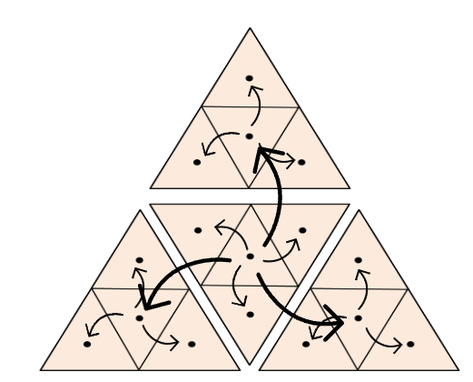

.. _multi_scale:

################################################
 Multi-scale connections at refined icosahedron
################################################

.. warning::

   This connection method is only support for building the connections
   within a set of nodes defined with the ``TriNodes`` or ``HexNodes``
   classes.

The multi-scale connections can only be defined with the same source and
target nodes. Edges of different scales are defined based on the
refinement level of an icosahedron. The higher the refinement level, the
shorther the length of the edges. By default, all possible refinements
levels are considered.

To use this method to build your connections, you can use the following
YAML configuration:

.. code:: yaml

   edges:
     -  source_name: source
        target_name: source
        edge_builders:
        - _target_: anemoi.graphs.edges.MultiScaleEdges
          x_hops: 1
          scale_resolutions: [1, 2, 3, 4]

where `x_hops` is the number of hops between two nodes of the same
refinement level to be considered neighbours, and then connected.

The `scale_resolutions` parameter controls which refinement levels are
included in the edge computation:

-  If an integer is provided (e.g., ``scale_resolutions: 4``), edges are
   computed for all levels from 1 up to and including that level (in
   this case, levels 1-4).

-  If a list is provided (e.g., ``scale_resolutions: [4]``), only edges
   at those specific levels are included.

-  If omitted, all possible refinement levels for the given nodes are
   used.

.. note::

   This method is used by data-driven weather models like GraphCast to
   process the latent/hidden state.

.. csv-table:: Triangular refinements specifications (x_hops=1)
   :file: ./tri_refined_edges.csv
   :header-rows: 1
